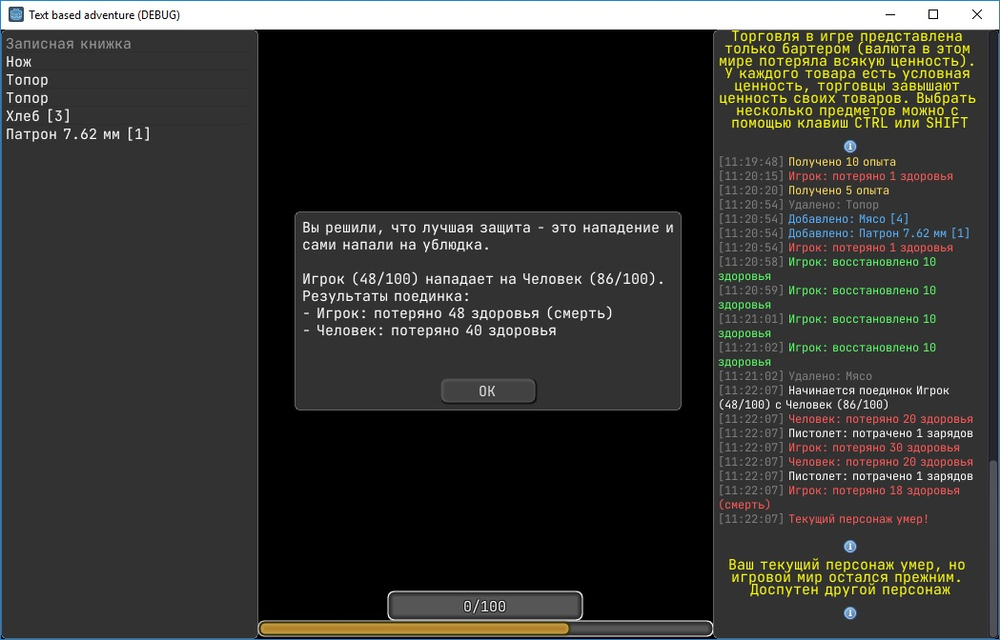
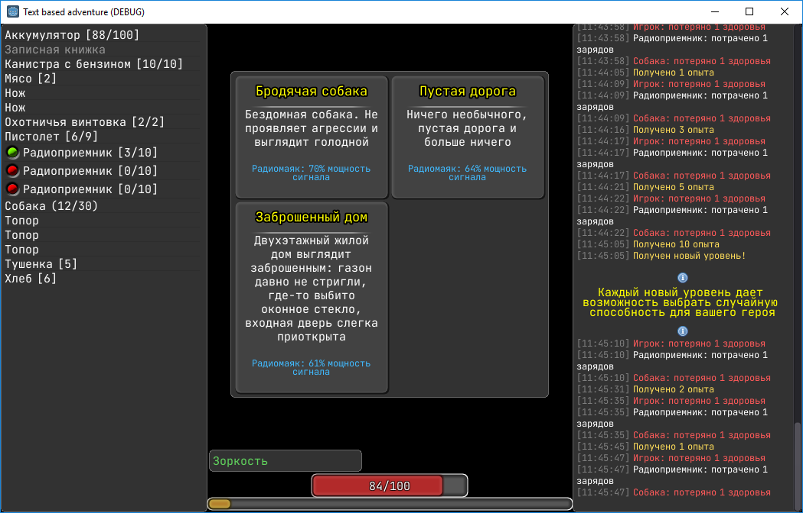
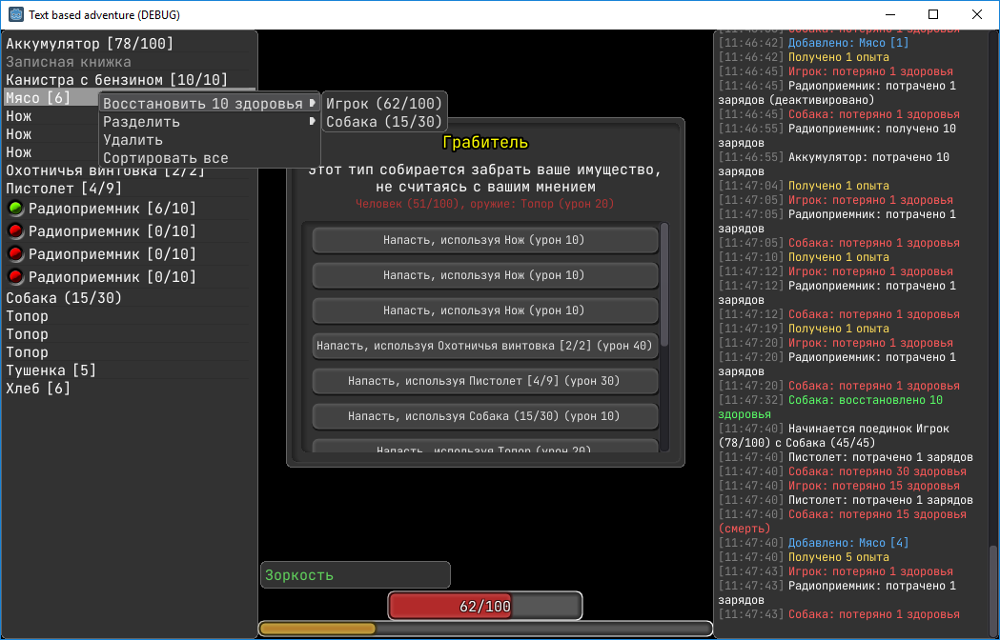
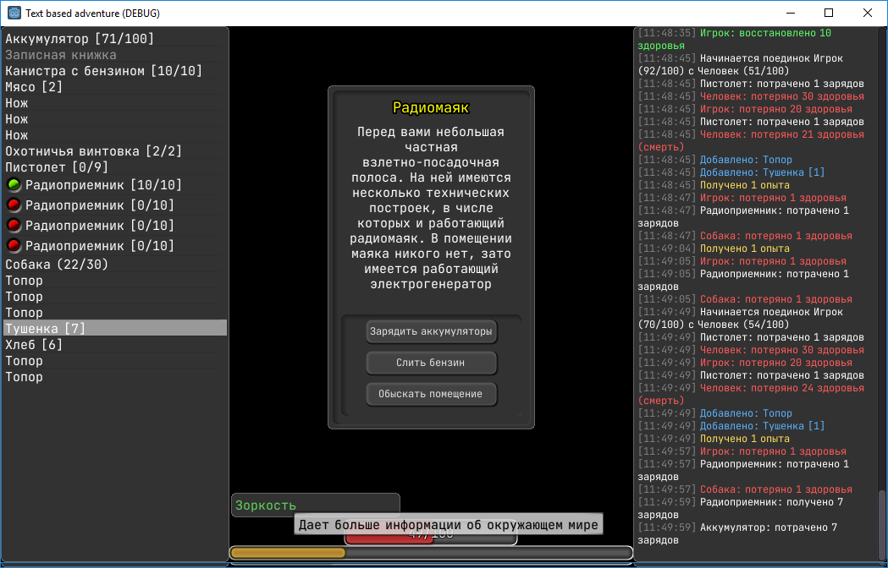

# П.Г.С. (рабочее название)
Игра на стадии тестирования концепта. Реализованы основные механики и небольшое количество контента для целей тестирования. Визуально игра представляется только элементами пользовательского интерфейса и текстовым контентом. Графический и звуковой контент не предусмотрены.

Цель игры заключается в поиске причин возникновения пандемии и способе борьбы с ней. В ходе поисков игровой персонаж может умереть, но игра продолжится за другого персонажа.
Управление только мышью. Для выбора нескольких предметов в некоторых случаях можно использовать клавиши CRTL и SHIFT

## Текущий прогресс (06.11.2021):

Web-версия: https://braven-ua.itch.io/gsp
ПК-версия: https://github.com/BRaven-UA/Text-based-adventure/releases/download/v.0.1.10/PGS_0.1.10.exe

